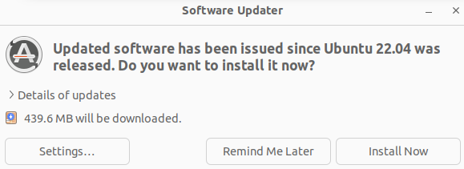

# lab0-环境

* **如果你不熟悉 Linux 的基本使用，请严格按照提示来配置实验环境。**
* **如果使用了本文提示之外的 Linux 发行版或者同一发行版的不同版本，请自行解决可能出现的各种问题。**

## 配置环境

### 安装 VMWare Workstation Pro

请 `STFW`。

### 下载 Ubuntu 22.04 镜像并安装

请 `STFW`。

建议安装清华源的 Ubuntu 22.04 镜像，点击[这里](https://mirrors.tuna.tsinghua.edu.cn/ubuntu-releases/22.04/ubuntu-22.04.5-desktop-amd64.iso)下载。

提醒：安装完 Ubuntu 22.04 后，如果有如下图弹窗提示，请不要点击更新！请不要点击更新！请不要点击更新！



**如果你对 Linux 命令行操作感到陌生，可以尝试看看这个入门介绍视频:** [**绿导师原谅你了：为什么要逼大家用 NOILinux**](https://www.bilibili.com/video/BV1MV411F738/)

### 配置 Ubuntu 22.04 环境

```bash
sudo apt update
sudo apt-get install build-essential man gcc-doc gdb git libreadline-dev libsdl2-dev vim
```

## 初次运行 `liemu`

获取项目源码:

```bash
git clone https://gitee.com/wangyaoyong/liemu.git
```

如果你善于使用 `git` 维护自己的代码，那么建议先 fork 该仓库，然后再 clone 你自己的仓库。

`liemu` 使用 `make` 来构建项目，你可以在项目根目录下看到 `Makefile` 文件。

在项目根目录下，你可以使用以下命令：

- `make` : 编译项目。
- `make run` : 编译并运行项目。
- `make clean` : 清理项目。
- `make gdb` : 使用 `gdb` 调试项目。

编译项目:

```bash
cd liemu
make run
```

如果看到了以下输出，说明你的环境配置成功了：

```bash
(liemu)
```

尝试输入 `help`，你会看到所有内置命令的提示。

```bash
(liemu)help
help:	show this help info
q:      quit liemu
clear:	clear the screen
c:	    continue to execute next instructions
si:	    si [N], execute N steps
info:	info r/w [reg_name/watchpoint], show reg/watchpoint value
x:	    x addr, print mem value on addr
xx:	    x addr, print mem value in cache on addr
ls:	    enable listing instructions automaticlly
w:	    add a watch point
d:	    d watchpoint delete a watch point
hit:	show cache hit rate
trap:	trap [trap_num], trigger a trap
queue:	show trap queue
```

- `help` : 显示帮助信息。
- `q` : 退出 `liemu`。
- `clear` : 清空屏幕。
- `c` : 继续执行剩余指令。
- `si` : 执行 N 条指令，例如 `si 5` 表示执行后续 5 条指令，如果不带参数，则默认执行 1 条指令。
- `info` : 显示寄存器或监视点的值，例如 `info r` 显示所有寄存器的值，`info r reg_1 reg_2` 会显示对应名称的寄存器的值。`info w` 显示所有监视点的值。
- `x` : 显示内存地址的值，例如 `x 0x80000000` 显示地址 `0x80000000` 的值。
- `xx` : 显示缓存中的内存地址的值，例如 `xx 0x80000000` 显示地址 `0x80000000` 的值。LAB2 后才可使用。
- `ls` : 打印当前指令附近的指令。
- `w` : 添加一个监视点，例如 `w 0x80000000` 添加一个监视点到地址 `0x80000000`。
- `d` : 删除一个监视点，例如 `d 2` 删除第 2 号监视点。
- `hit` : 显示缓存命中率。LAB2 后才可使用。
- `trap` : 触发一个异常，例如 `trap 1` 触发一个编号为 1 的异常。LAB4 后才可使用。
- `queue` : 显示异常队列。LAB4 后才可使用。

## RTFSC

这是必不可少的环节，不阅读源码，你将无法理解 LAB0 的任务，更无法完成后续的实验内容。这里完全不需要避讳使用 AI 来帮助你理解代码。当然，你至少应该知道从哪里开始阅读代码。

`liemu` 的源码都在 `src` 目录下，其中只有一个 `cpp` 文件，其余模块均采用头文件的形式。

## 任务

在初步阅读了代码之后，你需要完成一些任务，以检验你是否真的阅读了主要代码。
### Task 0 简答题

回答言之有理即可，不要求过于详细。

1. 大家都知道类和结构体的 `this` 指针，但是 `liemu` 中却使用了 `self.cpu` 这样的长得像 `python` 的写法，别担心，这仅仅是代码编写者的习惯。但是请问的是，这是如何做到的？
2. `liemu` 源码中多处使用到了 `inline` 关键词，请问 `inline` 都出现在了哪种情形中？为什么在那种情形中一定要使用 `inline` 关键词？
3. `liemu` 中多处使用了诸如 `[](const Inst& inst, Machine& m) {...}` 这样的写法，请问这是什么语法?

### Task 1 完善 `cmd_info`

`info` 命令用于显示一些信息。

其中输入 `info w` 会打印所有监视点的信息。

而输入 `info r` 会打印所有寄存器的信息，如果你输入例如 `info r a0 t1 sp` 则会只打印这三个寄存器的信息。

现在的代码中， `info w` 的功能已经实现了，但是 `info r` 相关的功能还没有实现，此时输入该命令会触发 `assert` 使得程序停止运行。请你完善之。

你会在需要实现的位置看到

```cpp
// LAB 0 todo
assert(0);
```

请删除 `assert(0);` 并实现 `info r` 的功能。

总结来说，那个相关的函数的参数是一个字符串的数组，其内容就是输入的命令的各个部分。例如，我输入了 `info r a0`，那么数组的内容就是 `{"info", "r", "a0"}`。如果参数只有 `{"info", "r"}`，那么就是打印所有寄存器的信息，否则就是打印指定寄存器的信息。打印寄存器信息的代码不需要实现，已经在某个位置实现了，你仅需要对应调用即可。

如果最终实现正确，那么输入 `info r` 会打印所有寄存器的信息，例如下面这样：

```bash
(liemu)info r
x0:	0x00000000	ra:	0x7ffffffc
sp:	0x83ffec00	gp:	0x0000abde
tp:	0x0000abde	t0:	0x0000abde
t1:	0x0000abde	t2:	0x0000abde
s0:	0x0000abde	s1:	0x0000abde
a0:	0x0000abde	a1:	0x0000abde
a2:	0x0000abde	a3:	0x0000abde
a4:	0x0000abde	a5:	0x0000abde
a6:	0x0000abde	a7:	0x0000abde
s2:	0x0000abde	s3:	0x0000abde
s4:	0x0000abde	s5:	0x0000abde
s6:	0x0000abde	s7:	0x0000abde
s8:	0x0000abde	s9:	0x0000abde
s10:0x0000abde	s11:0x0000abde
t3:	0x0000abde	t4:	0x0000abde
t5:	0x0000abde	t6:	0x0000abde
pc:	0x80000000
mtvec:
0x83fff000
mepc:
0x00000000
mcause:
0x00000000
mstatus:
0x00000008
```

输入 `info r a0 t1 sp` 会只打印这三个寄存器的信息，例如下面这样：

```bash
(liemu)info r a0 t1 sp
a0:	0x0000abde
t1:	0x0000abde
sp:	0x83ffdc00
```

## 提交

* 简答题请提交为一个文本文件，命名为 `lab0-task0.md`。如果你会使用 `markdown`，那么请使用 `markdown` 格式，否则就把它当作一个记事本txt文件来编写。
* 代码需要提交整个 `src` 目录。
* 请将以上文件打包为 `lab0.tar.gz` 并提交（如果你不知道如何打包成这样的格式，STFW）。
* 将 `lab0.tar.gz` 以附件的形式发送到指定的邮箱，其中邮件主题为 `lab0-学号-姓名`，例如 `lab0-920106114514-丁真`。

总的来说，在收到 `lab0.tar.gz` 之后，将解压缩，期望会得到一个名为 `lab0` 的目录，目录下有 `lab0-task0.md` 和 `src` 目录。

```bash
lab0
├── lab0-task0.md
└── src
    ├── Cache.hpp
    ├── common.hpp
    ├── CPU.hpp
    ├── Inst.hpp
    ├── Machine.hpp
    ├── main.cpp
    ├── Memory.hpp
    ├── sdb.hpp
    ├── Trap.hpp
    └── Watch.hpp
```
